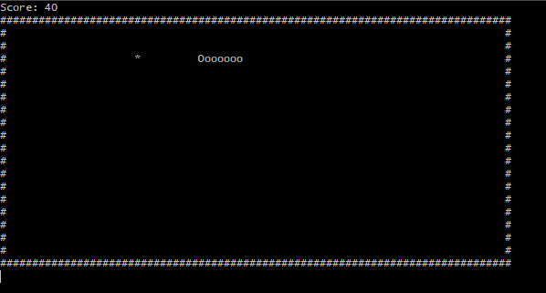
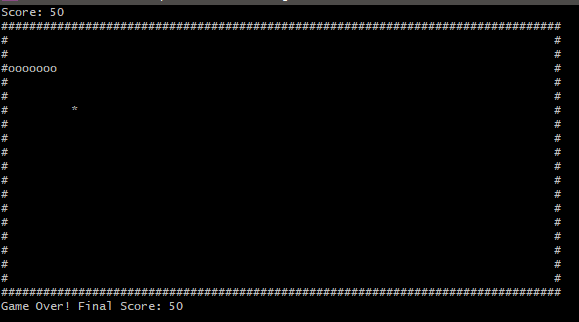

# 🐍 Snake Game in C (Console Version)

 

**Classic Snake, reinvented in C!**  
Control the snake, eat the fruit, grow longer, and avoid crashing into walls or yourself. Test your reflexes and aim for the highest score! 🎯

---

## 🎮 Features

- Smooth snake movement  
- Growth on eating fruit (`*`)  
- Collision detection with walls (`#`) and itself  
- Score tracking displayed in console  
- Arrow keys & WASD controls  
- Modular code structure (`main.c`, `snake.c`, `game.c`)  
- Easy to compile and run  

---

## 🖼 Screenshots

**Game Start:**  
  

**Mid-game / Eating Fruit:**  
  


---

## ⌨️ Controls

- **Arrow Keys** – Move the snake  
- **W / A / S / D** – Alternative controls  

---

## 🛠 How to Compile & Run

From the `src` folder:

```bash
gcc -I../include main.c snake.c game.c -o snake.exe
./snake.exe
